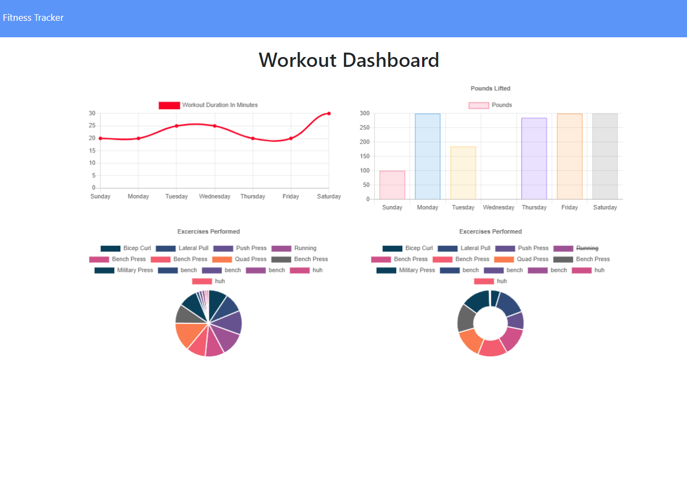

# Workout-Tracker

This is a full stack web application for tracking workout information and saving it to a MongoDB database

## Objective

- Configure an express server to handle html routes, api routes, and database handling using mongoose orm
- Write API routes to access a mongo database
- User can see their workout stats, add a workout, and create a workout

[Workout Tracker](https://github.com/Diegopie/Workout-Tracker) is hosted on Heroku.

## Outcome

This application was further practice at creating express servers, this time using a mongo database instead of a SQL database. I enjoy mongoDB and the Mongoose ORM make my life much easier 😅

## Bugs

Currently, workout durations are being rendered as undefined. It seems to be a configuration issue in the workout.js model

## Technology

This application relies on Bootstrap, jQuery, Express, and Mongoose

This application was authored by [Diego Hernandez](https://github.com/Diegopie)